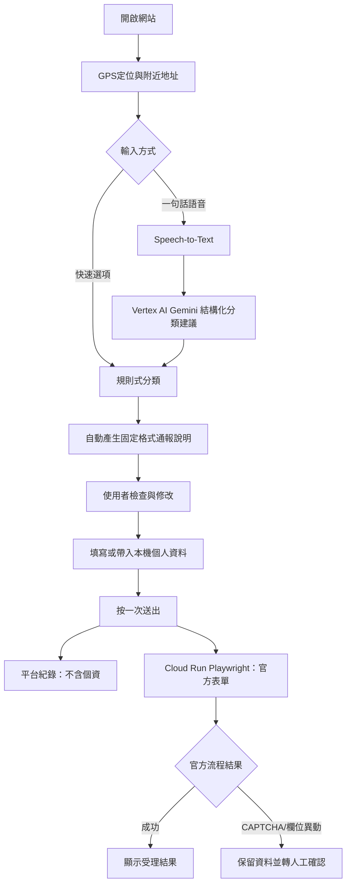

# SmellLogger 開發路線圖

## 目標

讓使用者在手機上完成「定位 → 描述臭味 → 確認資料 → 填入個人資料 → 按一次送出」，同時：

- 平台紀錄與具名陳情分離。
- 平台與 Google Sheet 不保存通報人個資。
- 語音與 LLM 只提供分類建議，不直接替使用者做法律或事實認定。
- 官方表單正式送出前保留清楚的使用者同意與安全閘門。
- 系統只把雲林縣作為預設分析範圍，但保留未來切換全部地區的能力。

## 目標使用流程

## 分階段工作與驗收條件

### Phase 0：基線與資料安全（目前大致完成）

工作項目：

- 根目錄只保留網頁入口，其餘程式分資料夾。
- Apps Script 公開分析資料不回傳通報人個資與原始 JSON。
- 前端送往平台前移除 `reporter`、`reporterConsent`、`reporterSource`。
- 個人資料只可選擇留在本機瀏覽器 localStorage。
- Google Maps、天氣服務設定集中於 `assets/js/app-config.js`。

驗收：

- 冒煙測試通過。
- GET 公開資料不含通報人欄位。
- 輸入空白通報人資料時仍可完成平台紀錄。

### Phase 1：手機通報體驗（優先）

工作項目：

1. GPS 定位與地圖點選。
2. 反向地址顯示到房號，不顯示樓層，地址結尾固定加「附近」。
3. 預設快速分類為「畜牧或堆肥異味／施肥或堆肥」。
4. 天氣、溫度、風速、風向寫入通報說明。
5. 以規則式選項產生穩定、可追蹤的說明文字。
6. 製作人顯示為「康嘉麟教授(中正大學化工系)」，並附製作人連結。
7. 通報說明附註「由 https://conlinkang.github.io/smelllogger/index.html 輔助填單」。
8. 增加手機可讀的語音／快速操作按鈕與狀態提示。

驗收：

- 使用者不填個資也能完成平台紀錄。
- 地址符合「房號附近」規則。
- 產生的文字可直接複製至官方表單。
- 手機窄版不需要水平捲動，主要按鈕可用單手操作。

### Phase 2：雲林縣資料分析與視覺化

工作項目：

- 分析頁預設篩選雲林縣。
- 支援全部地區切換。
- 依日、月、時段與臭味程度統計。
- 地圖標記、熱點與列表互相連動。
- 顯示資料筆數、平均／最高臭味程度、熱門時段與主要分類。
- 對舊資料使用地址 fallback，對新資料使用 `locationCounty`／`locationTown`。
- 提供載入、空資料、API 錯誤與地圖失敗狀態。

驗收：

- 雲林縣預設結果與地址資料一致。
- 切換全部地區後不會遺漏資料。
- 地圖 API 失敗時，統計與列表仍可使用。

### Phase 3：環境部固定欄位半自動填單

工作項目：

- 快速選項對應環境部異味分類。
- 預填污染者名稱「不明」及第二階段欄位。
- 預填污染地點縣市、鄉鎮與地址備註。
- 預填回覆方式、會同稽查與具名通報人欄位。
- 維護官方欄位 selector 與每頁驗證。
- 官方欄位變更時回傳 `manual_required`，不可靜默誤填。

驗收：

- 以虛構資料能走到官方確認頁。
- 不會按下官方最後送出。
- CAPTCHA、網頁錯誤或 selector 變更時保留資料並提示人工處理。

### Phase 4：Cloud Run Playwright 自動填單

工作項目：

- 部署 `official-form-runner/`。
- 使用 Cloud Run service identity 與最小 IAM 權限。
- 設定正式網站 CORS、請求大小上限、逾時與速率限制。
- 不記錄 request body、不保存截圖、不保存音訊、不建立個資資料庫。
- 支援 `mode=prepare` 與 `mode=submit`；正式環境已啟用 `submit`，但仍受服務端精確開關與具名確認條件保護。
- 官方最終送出必須同時具備明確勾選、完整具名資料與一次性確認文字。

部署閘門：

- Google Cloud 專案：`stinky-smell-map`。
- 帳號必須完成 Google Cloud 要求的兩步驟驗證。
- 啟用 Cloud Run、Artifact Registry、Cloud Build、Speech-to-Text、Vertex AI API。
- 建立專用服務帳號，不把服務帳號金鑰放入前端或 repository。
- 先以 prepare-only 與本機攔截測試驗證；正式環境不以假資料呼叫最後送出，以免建立誤報案件。

### Phase 5：一句話語音與 LLM 分類

工作項目：

- 前端使用 `MediaRecorder` 錄製短音訊，限制長度與檔案大小。
- Cloud Run 以 Speech-to-Text 轉換繁體中文語音。
- Vertex AI Gemini 只輸出固定 JSON：臭味等級、臭味類型、官方快速分類、持續時間、疑似來源、影響與補充文字。
- 使用 JSON schema／enum 限制模型只能選既有選項。
- 前端顯示逐項建議與信心提示，使用者可以修改。
- 不讓模型產生或猜測姓名、電話、地址、污染者身分或法律結論。
- 不保存音訊與逐字稿；錯誤時回到快速選項模式。
- `voiceAnalysisEndpoint` 未設定時，功能保持關閉，不影響一般通報。

驗收：

- 一句「斗六市附近有很重的畜牧堆肥味，持續半小時」能產生候選分類。
- 模型回傳不符合 schema 時不套用資料。
- 使用者可在按送出前逐項修改。
- Cloud Run 與前端均不記錄音訊、逐字稿與個資。

### Phase 6：整合一次按鈕流程

工作項目：

1. 先送平台紀錄（不含個資）。
2. 若有完整具名資料且使用者確認，再呼叫環境部填單服務。
3. 顯示兩個獨立結果：平台紀錄結果、環境部陳情結果。
4. 官方服務失敗時不回滾平台紀錄，保留可複製資料與官方連結。
5. 防止重複按鈕、重複案件與逾時重送。

驗收：

- 具名資料完整時，使用者只需按一次送出即可觸發兩條流程。
- 無具名資料時，只保存平台紀錄，不捏造預設通報人。
- 任一條流程失敗時，畫面明確指出是哪一條失敗。

### Phase 7：上線前安全、法遵與維運

工作項目：

- 檢查官方服務條款、CAPTCHA 與自動化限制。
- 加入 Cloud Run 日誌脫敏、錯誤追蹤、逾時與成本上限。
- 監控 Speech-to-Text／Vertex AI／Playwright 錯誤率與延遲。
- 每次官方表單改版先跑 prepare-only smoke test。
- 寫明隱私告知、資料保留期限、使用者責任與人工替代流程。
- 針對手機瀏覽器、麥克風拒絕、定位拒絕、網路中斷與無障礙操作測試。

## 目前狀態

- Phase 0：完成，Apps Script 已部署第 18 版。
- Phase 1：大部分完成；製作人名稱與官方輔助填單備註列入下一個小變更。
- Phase 2：完成第一版雲林縣預設篩選與統計資料欄位。
- Phase 3：完成；已用官方目前頁面實測 selector，並以假資料走過第一至第三階段。
- Phase 4：完成部署與驗證；Cloud Run revision `smelllogger-runner-00007-dfq` 已啟用正式送出，`/health` 回傳 `officialSubmitEnabled:true`，CAPTCHA 與未確認結果仍回到 `manual_required`。
- Phase 5：完成前端與 Cloud Run 語音流程；Speech-to-Text 使用 `default` 支援 `zh-TW`，已用不含個資的測試句完成轉寫與 Vertex AI 結構化分類。
- Phase 6：前端已接上 Cloud Run `/submit` 與 `/analyze-voice`，測試版本已切換 `officialSubmissionMode=submit`；GitHub Pages 發佈後仍需進行人工監看驗收。
- Phase 7：尚未完成。

## 每次迭代固定流程

1. 先修改本機程式與測試。
2. 執行語法檢查、冒煙測試與資安字串檢查。
3. 用虛構資料測試，不按官方最終送出。
4. 更新 Apps Script／Cloud Run 的版本與健康檢查。
5. 讀回部署結果，確認實際版本與 endpoint。
6. 更新本文件的完成狀態與已知限制。
7. 只有在前一階段驗收通過後，才開啟下一階段。

## 主要參考

- [環境部公害污染陳情網路受理系統](https://ww3.moenv.gov.tw/Public/Case_Add.aspx)
- [Google Cloud Speech-to-Text](https://docs.cloud.google.com/speech-to-text/docs/overview)
- [Google Gen AI SDK on Vertex AI](https://cloud.google.com/vertex-ai/generative-ai/docs/sdks/overview)
- [Cloud Run service identity](https://docs.cloud.google.com/run/docs/securing/service-identity)
## Current implementation note: acoustic cue

Voice analysis now includes an optional, coarse browser-side loudness/pitch cue. It is deliberately separated from emotion recognition: no anger, personality, or truthfulness classification is performed. The cue can only increase the review requirement when text does not clearly communicate intensity; it cannot override the user's selected odor level.
